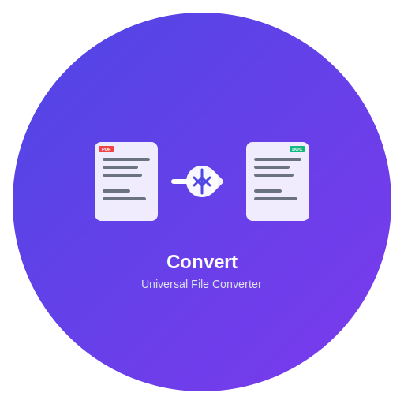

# Convert - Universal File Converter

## Installation Instructions

### macOS Installation

#### Option 1: DMG Installer (Recommended)
1. Download the latest `Convert-{version}-arm64.dmg` file from the releases page
2. Double-click the DMG file to mount it
3. Drag the Convert app to your Applications folder
4. Eject the DMG file
5. Launch Convert from your Applications folder

#### Option 2: ZIP Archive
1. Download the latest `Convert-{version}-arm64.zip` file from the releases page
2. Extract the ZIP file
3. Move the Convert.app to your Applications folder
4. Launch Convert from your Applications folder

### First Launch

When you first launch Convert, macOS may show a security warning because the app is not signed with an Apple Developer certificate. To run the app:

1. **If you see "Convert can't be opened because it's from an unidentified developer":**
   - Right-click (or Control-click) on the Convert app in Applications
   - Select "Open" from the context menu
   - Click "Open" in the security dialog

2. **If you see "Convert is damaged and can't be opened":**
   - Open Terminal
   - Run: `sudo xattr -rd com.apple.quarantine /Applications/Convert.app`
   - Enter your password when prompted
   - Try launching the app again

### System Requirements

- **Operating System:** macOS 10.15 (Catalina) or later
- **Architecture:** Apple Silicon (M1/M2/M3) or Intel x64
- **Memory:** 4GB RAM minimum, 8GB recommended
- **Storage:** 100MB free space for installation

### Supported File Formats

Convert supports a wide range of file formats including:

#### Documents
- PDF ↔ DOCX, TXT, HTML
- DOCX ↔ PDF, TXT, HTML
- TXT ↔ PDF, DOCX, HTML
- HTML ↔ PDF, DOCX, TXT

#### Images
- PNG, JPG, JPEG, GIF, BMP, TIFF
- SVG to raster formats
- Format conversion and resizing

#### Videos (via FFmpeg)
- MP4, AVI, MOV, MKV, WebM
- Format conversion and compression
- Basic video editing capabilities

#### Archives
- ZIP file extraction and creation
- Support for nested archives

### Features

- **Drag & Drop Interface:** Simply drag files into the app to convert them
- **Batch Processing:** Convert multiple files at once
- **Format Detection:** Automatic input format detection
- **Quality Settings:** Adjustable output quality for images and videos
- **Progress Tracking:** Real-time conversion progress
- **Error Handling:** Clear error messages and recovery options

### Troubleshooting

#### App Won't Launch
- Ensure you're running macOS 10.15 or later
- Try the quarantine removal command mentioned above
- Check that you have sufficient disk space

#### Conversion Errors
- Verify the input file is not corrupted
- Ensure you have write permissions to the output directory
- Check that the input file format is supported

#### Performance Issues
- Close other applications to free up memory
- For large video files, ensure you have sufficient disk space
- Consider converting files in smaller batches

### Privacy & Security

Convert processes all files locally on your device. No files are uploaded to external servers, ensuring your data remains private and secure.

### Support

For support, bug reports, or feature requests:
- Email: support@convertapp.com
- GitHub Issues: https://github.com/convert-app/convert/issues

### License

Convert is released under the MIT License. See the LICENSE file for details.

---

**Convert** - Making file conversion simple and accessible.